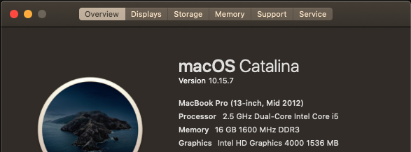

# vettel

A simple key-value store written in ~300 lines of C code. currently, you can perform the following commands.


# building

```bash
$ ./make.sh # will output the binary at ./out/vt
$ ./out/vt
```

# benchmark results

| test (adding 1000 keys to the store) | result   |
| ------------------------------------ | -------- |
| [vettel](./benchmarks/vettel.py)     | `10.72s` |
| [redis](./benchmarks/redis.py)       | `13.26s` |

-   `vettel`

```shell
________________________________________________________
Executed in   10.72 secs    fish           external
   usr time    2.76 secs  145.00 micros    2.76 secs
   sys time    5.10 secs  856.00 micros    5.10 secs

```

-   `redis`

```shell
________________________________________________________
Executed in   13.26 secs    fish           external
   usr time    3.40 secs  162.00 micros    3.40 secs
   sys time    6.27 secs  882.00 micros    6.26 secs

```

> **_INFO:_** the above tests were ran on my mid-2012 Macbook Pro
> 
